<p align="center">
  
</p>

# Awesome Data Science Interview Q&A 🎯

<!-- SEO Metadata -->
<!-- Keywords: Data Science Interview Questions, Machine Learning Q&A, Deep Learning Interview, SQL Interview Prep, Python Coding, A/B Testing, MLOps, System Design, Data Analyst prep, ML Engineer technical interview -->
<!-- Description: A curated, no-fluff collection of Data Science and Machine Learning interview questions and answers organized by topic. -->

<a href="https://github.com/ishandutta2007/Awesome-Awesome-Awesome"></a><a href="https://discord.gg/jc4xtF58Ve"></a>[](https://awesome.re) [](CONTRIBUTING.md) [](LICENSE) <a href="https://github.com/ishandutta2007"></a>

A curated, no-fluff collection of **Data Science / Machine Learning interview questions with answers**, organized by topic. Built for candidates prepping for DS, ML Engineer, Applied Scientist, and Analytics roles — and for interviewers building question banks. 🚀

Every answer aims to be **concise, correct, and interview-ready** — the kind of answer that would actually land well in a 45-minute technical round, not a textbook chapter. 💡

> ⭐ Star this repo if it helps your prep. PRs adding new questions, fixing answers, or improving explanations are very welcome — see [CONTRIBUTING.md](CONTRIBUTING.md).

---

## 📚 Table of Contents

| # | 🗂️ Topic | ❓ Questions | ⚡ Difficulty Mix |
|---|-------|-----------|-----------------|
| 01 | [Statistics & Probability](topics/01-statistics-probability.md) | 15 | Easy → Hard |
| 02 | [Machine Learning (Classical)](topics/02-machine-learning.md) | 18 | Easy → Hard |
| 03 | [Deep Learning](topics/03-deep-learning.md) | 15 | Medium → Hard |
| 04 | [SQL](topics/04-sql.md) | 15 | Easy → Hard |
| 05 | [Python & Coding](topics/05-python-coding.md) | 14 | Easy → Hard |
| 06 | [A/B Testing & Experimentation](topics/06-ab-testing.md) | 12 | Medium → Hard |
| 07 | [Case Studies & Product Sense](topics/07-case-studies-product-sense.md) | 10 | Medium → Hard |
| 08 | [Data Structures & Algorithms](topics/08-data-structures-algorithms.md) | 12 | Easy → Hard |
| 09 | [Big Data & Tools (Spark, Airflow, Cloud)](topics/09-big-data-tools.md) | 12 | Medium |
| 10 | [NLP](topics/10-nlp.md) | 12 | Medium → Hard |
| 11 | [Behavioral & Resume-based](topics/11-behavioral.md) | 12 | Easy → Medium |
| 12 | [System Design & MLOps](topics/12-system-design-mlops.md) | 10 | Hard |

**Total: ~157 questions** in v1, growing with community contributions. 📈

---

## 🧭 How to Use This Repo

- 🗓️ **Cramming for an interview next week?** Start with the topic weighted heaviest for your target role (see below), and read the "Follow-up" notes — interviewers almost always dig deeper.
- 🧠 **Deep prep over weeks?** Work through every file top to bottom, and re-derive the math yourself instead of just reading the answer.
- 👥 **Interviewing candidates?** Use these as a base question bank — mix easy/medium/hard per round, and use the follow-ups to gauge depth.

### 🎯 Suggested focus by role

| 💼 Role | 🔍 Prioritize |
|------|------------|
| 📊 Data Scientist (Product) | Stats/Probability, A/B Testing, Case Studies, SQL |
| 🤖 Data Scientist (ML-heavy) | Classical ML, Deep Learning, Python, System Design |
| ⚙️ ML Engineer | Deep Learning, System Design/MLOps, Python & Coding, DSA |
| 📈 Data Analyst | SQL, Stats/Probability, Case Studies, Python |
| 🔬 Applied/Research Scientist | Deep Learning, NLP, Stats/Probability, ML theory |

---

## 🗂️ Repo Structure

```
Awesome-DataScience-Interview-QA/
├── README.md                 ← you are here
├── CONTRIBUTING.md
├── LICENSE
└── topics/
    ├── 01-statistics-probability.md
    ├── 02-machine-learning.md
    ├── 03-deep-learning.md
    ├── 04-sql.md
    ├── 05-python-coding.md
    ├── 06-ab-testing.md
    ├── 07-case-studies-product-sense.md
    ├── 08-data-structures-algorithms.md
    ├── 09-big-data-tools.md
    ├── 10-nlp.md
    ├── 11-behavioral.md
    └── 12-system-design-mlops.md
```

## 🛣️ Roadmap (v2+)

- [ ] Add "Company tags" (which companies are known to ask variants of each question)
- [ ] Add a `/mock-interviews` folder with full 45-min simulated loops
- [ ] Add difficulty badges per question
- [ ] Add a companion `Awesome-DataScience-Interview-QA-CheatSheets` repo for formulas
- [ ] Community-submitted "how I answered this in a real interview" notes

## 🤝 Contributing

This is meant to be a living, community-curated resource. See [CONTRIBUTING.md](CONTRIBUTING.md) for the format to follow when submitting a question.

## 📄 License

Content is released under the [MIT License](LICENSE) — free to use, fork, and adapt.

---

*Maintained by [@ishandutta2007](https://github.com/ishandutta2007). Part of a series of "Awesome" curated technical resources.*
